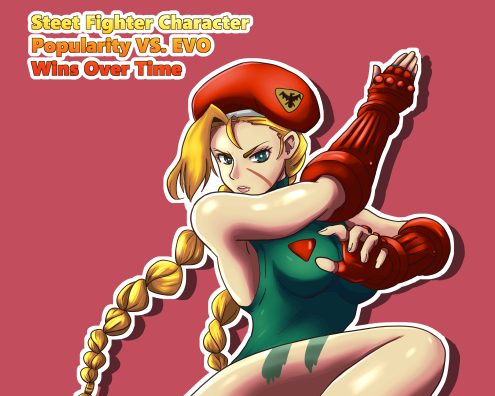

# Street-Fighter-Character-Popularity-vs.-EVO-Tournament-Wins-Over-Time



## About
Greetings! This analysis will dive into the world of Street Fighter (a game created a pubished by Capcom), and the world of Evolution Championship Series (also known as EVO tournaments.) More importantly we will be asking a simple question of, "Does character popularity affect player choice in tournament play?"

## History
Street Fighter is one of the most iconic and influential video game franchises in history. Spawning mulitple games, spinoffs, animated movies and series, comic books, and even a live action movie!  

Characters are from different countries and have different fighting styles. This variety coupled with unique and colorful designs are some of the factors that made it very popular in the 90s and launched it into video game stardom. To this date, there are around 80 characters in the franchise.

The Evolution Championship Series (EVO) is the world's largest and most prestigious fighting game tournament, celebrating competitive gaming and the fighting game community. Initially focused on Street Fighter II and Street Fighter Alpha 2, EVO expanded over the years to include a wide range of fighting games, from Tekken and Mortal Kombat to Super Smash Bros. and Guilty Gear. Known for its open-bracket format, EVO fosters inclusivity by allowing players of all skill levels to compete.

## Data Sources

CSVs:
Located in the 'CSVs Files' folder.
- evo_results.csv [Data pulled from using a web scraper on wikipedia] (https://streetfighter.fandom.com/wiki/Evolution_Championship_Series#Results)
- top_street_fighter_character.csv [Data auto-generated by ChatGPT]

## Installation
Before you begin, ensure you have met the following requirements:

- You have installed Python. This project was developed using Python 3.11.1. If you don't have Python installed or if you need to upgrade your current version, you can download it from the [official Python website](https://www.python.org/downloads/).
- You have installed Git, which is necessary to clone the repository. If you don't have Git installed, you can download it from the [official Git website](https://git-scm.com/downloads).

Follow these steps to run the project on your local machine:

1. **Clone the repository**

   Navigate to the directory where you want the cloned repository to be placed by using the ```cd``` command in your terminal followed by the path of the directory.
   
   Then you can clone this repository by running the following command in your terminal:

   ```
   git clone https://github.com/ChristopherHibbard/Street-Fighter-Character-Popularity-vs.-EVO-Tournament-Wins-Over-Time.git
   ```
  
3. **Navigate to the cloned directory**

   Change your current directory to the cloned repository's directory Street-Fighter-Character-Popularity-vs.-EVO-Tournament-Wins-Over-Time

4. **Set up a virtual environment**

   It's recommended to create a virtual environment to keep the project's dependencies isolated from your system's Python environment. You can create a virtual environment using the following command:

   On Windows:

   ```
   python -m venv venv
   ```

   On macOS and Linux:

   ```
   python3 -m venv venv
   ```

   This will create a new virtual environment named `venv` in your current directory.

4. **Activate the virtual environment**

   Activate the virtual environment using the following command:

   On Windows:

   ```
   .\venv\Scripts\activate
   ```
   If that doesn't work try:

   source venv/Scripts/activate

   On macOS and Linux:

   ```
   source venv/bin/activate
   ```

   Your prompt should change to indicate that you are now operating within a Python virtual environment. 

   **Note!** To deactivate the virtual environment when you're done, simply type `deactivate` in your terminal.

5. **Install the required packages**

   Install the required packages by running the following command:

   ```
   pip install -r requirements.txt
   ```


## Ready to start!
   
Now we are ready to run our python codes and interpret our data!

**Procedure**


**Note**
    Because of how my scraper was structured, I had to modify the evo_result.csv file manually to create viable data. Do not run Scraper.py
    I also had ChatGPT auto-generate a mock list of the most popular street fighter character per year named top_street_fighter_character.csv
    So basically, I did the hard work for you. You're Welcome!
    Also, all CSV files and graph will populate in the CSVs Files folder.

**Run the python files in order**
    - First we will run the Street_Fighter_Character_df.py (This merges and creates a data frame of the two provided cvs files)
    - Second run placement_pivot_table.py (This compiles data and tally's the number of times the top player was used in the tournament.)
    - Third run the Graph_Generator.py (This visualizes the data from the pivot table in a nice little bar graph)
    - Finally pat yourself on the back. You did it! You ran the files in the correct order!

## Summary of Findings ##
**Summary**
- According to the data, the only specific correlation of character popularity vs. tournament usage was at EVO 2005. This is most likely due to the prior year's tournament when a viral moment was captured between Daigo Umehara and Justin Wong. During their match Daigo parried Justin's super move 15 times while his health meter was low. Daigo was playing as Ken, and Justin played as Chun-Li. Although Daigo won with Ken, Justin's use of Chun-Li's versatile moveset catapulted her popularity and possibly set her up as everyone's favorite in 2005.

- The pivot data table also shows that the character Chun-Li was used more overall through EVO tournament history. Chun-Li also had more first place finishes than any other character.

- In conclusion as mentioned above, their is no real correlation between character popularity and EVO tournament wins/placements. In the end, people will pick the characters based on their playstyle, personality, visual appeal and overall use in situations versus other characters.

**Issues with Findings**
- Although the data represented is precise, it is not perfect and subject to errors. One of the biggest errors is lack of all overall standings in the tournaments as well as players that use multiple different characters. 
- There are also different versions of Street Fighter being played at each EVO. This factors in greatly. Character models, skill sets, and super moves can change and some characters might not be in the games that's being played at that tournament. In some instances, more than one version of Street Fighter was played at the tournament.
- The graph and pivot table only goes to EVO 2022 and some data is missing. This is because their were no popular characters used during those events. Especially in 2020 and 2021 during the covid pandemic.

**Other Notes**
- The scraper I used to scrap the wiki page did a decent job at compiling the data. However, I had to manually manipulate the CSV file to include the game that was being played at the tournaments that year.
- The popularity results were auto-generated by ChatGPT and may not be accurate.
- I drew the picture on this readme file. It's of Cammy from Street Fighter. One of my favorite characters!

## Code:YOU Data Analysis Capstone requirements met.
   (Choose only one.)

**Category 1: Loading Data:**
- Read TWO data files (CSV).
- Scraped ONE piece of data from anywhere.

**Category 2: Clean and Operate the Data While Combining Them:**
- Clean your data and perform a pandas merge with your data sets, then calculate some new values based on the new data set.

**Category 3: Visualize/Present Your Data:**
- Make at least 1 Pandas pivot table and 1 matplotlib/seaborn plot.
  
**Category 4: Best Practices:**
- Utilize a virtual environment and include instructions in your README on how the user should set one up.
- List dependencies in a requirement.txt file.

**Category 5: Interpretation of Your Data:**
- Annotate your .py files with well-written comments and a clear README.md


    
    


